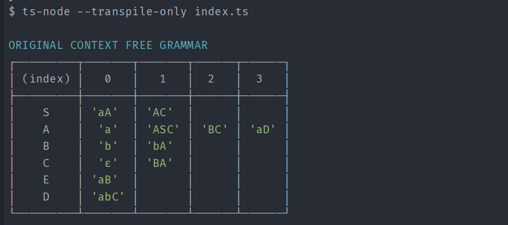
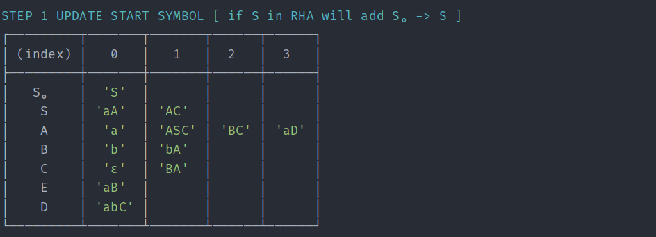
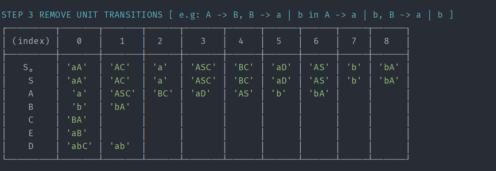
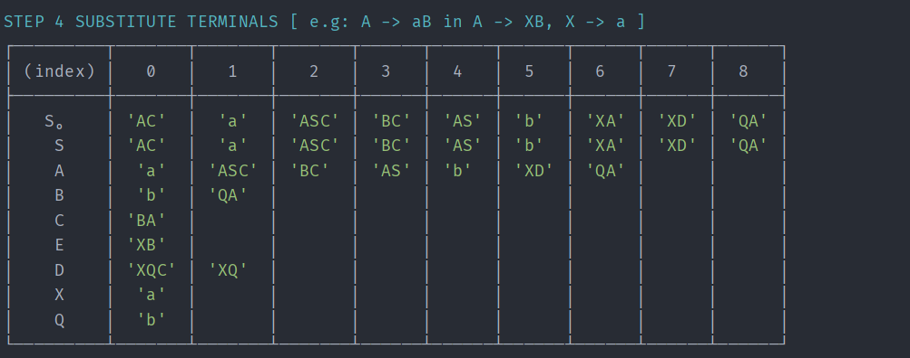
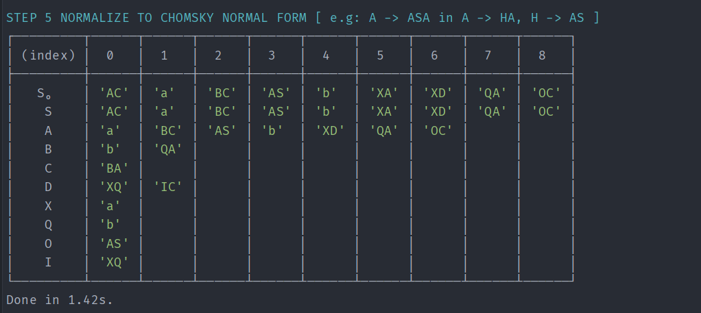
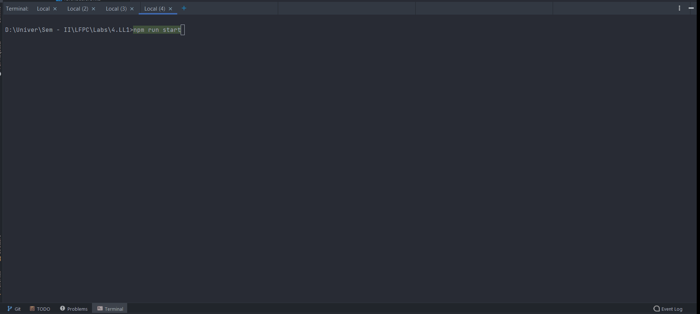

# Formal languages and Compiler design 

Pasecinic Nichita

- NodeJS-TypeScript CLI to convert a regular grammar to Finite Automaton (FA)

- Check if some input string is accepted by generated FA

  ***Demo***

  

## Convert NFA to DFA

- Program to convert input NFA to DFA, respecting all transitions and rules.

  sample input NFA:

  ```typescript
  const nfa_sample: I_FA = {
      'q0': {
          'a': ['q1'],
          'b': ['q0'],
      },
      'q1': {
          'a': [],
          'b': ['q1', 'q2'],
      },
      'q2': {
          'a': ['q2'],
          'b': ['q3'],
      },
      'q3': {
          'a': [],
          'b': []
      }
  }
  const nfa_a: string[] = ['a', 'b']
  const nfa_start: string = 'q0';
  const nfa_terminal: string = 'q3';
  ```

  sample console output DFA:

  ```typescript
  corresponding dfa:  {
      '->q0': { 
          'a': [ 'q1' ], 
          'b': [ 'q0' ] 
      },
      'q1': { 
          'a': [], 
          'b': [ 'q1', 'q2' ] 
      },
      'q1q2': { 
          'a': [ 'q2' ], 
          'b': [ 'q1', 'q2', 'q3' ] 
      },
      'q2': { 
          'a': [ 'q2' ], 
          'b': [ 'q3' ] 
      },
      '*q3': { 
          'a': [], 
          'b': [] 
      },
      '*q1q2q3': { 
          'a': [ 'q2' ], 
          'b': [ 'q1', 'q2', 'q3' ] 
      }
  }
  ```

  *More NFA examples can be seen in NFA_test.ts* 

  ##### The program results are shown in form on the transition table

  


------

## Convert CFG to CNF 

- was used same structure (as in previous labs) to represent the grammar 
- each step is a separate function which works independently and returns a new, updated grammar
- utils - set of simple and useful utils to check if the grammar meets a certain condition (mostly)
- ACTUAL PERFORMED STEPS:
  1.  Check if S in RHA, if so update grammar with S0
  2.  Remove null (ε) transitions and any remaining
  3.  Remove unit transitions and any duplicates
  4.  Substitute terminals in transitions with multiple variables to correspond to CNF 
  5.  Substitute the transitions with more then 2 non terminals and non reachable or useless transitions to correspond to CNF
- at each step is shown the current grammar in form of a table, then it is easy to follow the steps and check for correctitude (at least, I think so)













`To run the programs:` 

1. `clone repository`
2. `cd into specific lab work`
3. `run npm install or yarn install`
4. `run npm start or yarn start`

---------

## **LL1 Parser**

- the console app is in [4.LL1](https://github.com/nikitaal/LFPC-Labs/tree/master/4.LL1)

  `To run it:` 

  1. `clone repository`

  2. `cd 4LL1 folder`

  3. `run npm i`

  4. `run npm start`

  5. `you can change the productions to be parsed by changing the arguments of main function in index.ts`

  6. `find and modify the test cases from tests/index.ts directory`

  7. `Parse tree works fine too, though is not that easy to follow as on web version of the application`

     **Here is a quick demo**

     

- the web application with reach UI to visualize the ll1 steps is in [ll1-react-app](https://github.com/nikitaal/LFPC-Labs/tree/master/ll1-react-app) and the same logic from  [4.LL1](https://github.com/nikitaal/LFPC-Labs/tree/master/4.LL1) was used for express api from [ll1-expressjs-api](https://github.com/nikitaal/LFPC-Labs/tree/master/ll1-expressjs-api)

  `To run the aplication:` 

  1. `clone repository`

  2. `cd into ll1-expressjs-api folder`

  3. `run npm i`

  4. `run npm run dev`

  5. `cd into ll1-react-app`

  6. `run npm i`

  7. `run npm run start`

  8. `will be opened default http://localhost:3000/`

  9. `Now you can load predifined productions and parse any word or add your own productions and try to parse it`

  10. `Parse tree works fine too`

      **Here is a quick demo**

      

  Note: most of the edge-cases were covered for each step, but there can still appear some recursion errors for ambiguous productions. 
